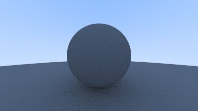
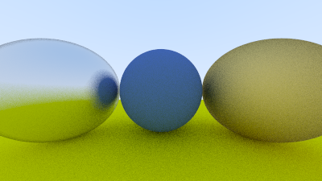

# Ray Tracer

Trying to learn ray tracing in one weekend.

## Build and run project

I hope you know how to do the obvious -
```bash
$ git clone https://github.com/Suvansarkar/raytracer
$ cd raytracer
```

Next generate make files using cmake
```bash
$ mkdir build
$ cmake -B build
```

Now build the project
```bash
$ cmake --build build
```

Run the project
```bash
$ ./build/raytracer > output.ppm
```

> Note: This ray tracer only outputs to ppm format. You can use `convert` command to convert it to other formats.

```bash
$ convert output.ppm output.png
```

## Sample images




## Creating your own scenes

Add your own shapes to the main.cc file along with their materials.
More shapes and materials are to be added later.

## TODO

- [ ] Add a plane shape
- [ ] Add a cube shape 
- [ ] Add dielectric materials (glass, water, etc)
- [ ] Add light sources using Phong Lighting model

## Resources / References

### Ray Tracing
- [the ray tracing book](https://raytracing.github.io/books/RayTracingInOneWeekend.html)
- [A pixel is not a square](https://www.researchgate.net/publication/244986797_A_Pixel_Is_Not_A_Little_Square_A_Pixel_Is_Not_A_Little_Square_A_Pixel_Is_Not_A_Little_Square)
- [Anti Aliasing](https://www.geeksforgeeks.org/antialiasing/)

### Lighting
- [Blog on phong lighting](https://paroj.github.io/gltut/Illumination/Tut11%20Phong%20Model.html)
- [Phong lighting princeton article](https://www.cs.princeton.edu/courses/archive/fall03/cs526/papers/lafortune94.pdf)
